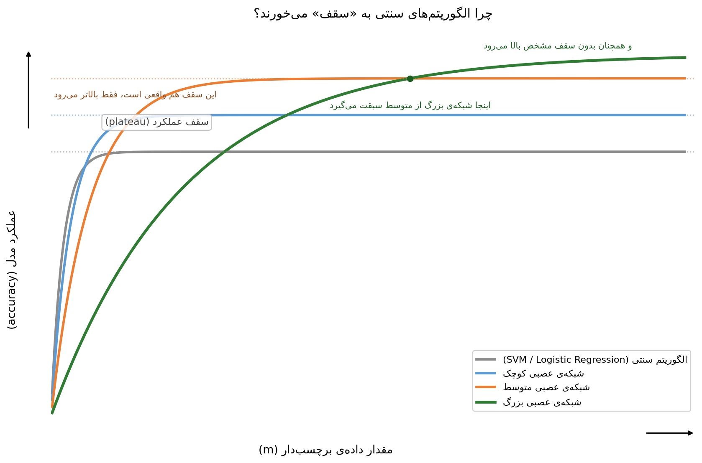

# نوت ۱: ظرفیت شبکه‌ی عصبی و نقش مقیاس در موفقیت Deep Learning

**پیش‌نیاز:** آشنایی مقدماتی با machine learning (regression، classification، مفهوم training/test set)

اگر کمی با machine learning آشنا باشید، احتمالاً این سؤال برایتان پیش آمده: شبکه‌های عصبی که پایه‌ی Deep Learning هستند، از دهه‌ی ۱۹۸۰ وجود داشتند. پس چرا فقط در ده-پانزده سال گذشته این‌قدر قدرتمند شدند؟

جواب کوتاه: **نه یک اتفاق، بلکه هم‌زمانی و درهم‌تنیدگی سه عامل** — داده، محاسبات، و الگوریتم. این سه عامل مستقل از هم نیستند؛ هر کدام دیگری را ممکن یا ضروری می‌کند. قبل از هر چیز، چند نوتیشن پایه را تعریف می‌کنیم که در تمام این دوره تکرار می‌شوند.

## نوتیشن پایه‌ی دوره

این نمادها را از همین‌جا حفظ کنید چون در تمام فرمول‌های آینده‌ی این specialization استفاده می‌شوند:

- $x$ — بردار ویژگی‌های ورودی یک نمونه (مثلاً اندازه‌ی خانه، تعداد اتاق‌خواب)
- $y$ — برچسب یا خروجی درست برای همان نمونه (مثلاً قیمت خانه)
- $m$ — تعداد کل نمونه‌های موجود در training set
- $(x^{(i)}, y^{(i)})$ — نمونه‌ی $i$-اُم از training set، که $i$ از ۱ تا $m$ تغییر می‌کند
- **داده‌ی برچسب‌دار (labeled data)** — مجموعه‌ای که هم $x$ و هم $y$ برایش موجود است؛ این چیزی است که در نمودارهای این بخش روی محور افقی قرار می‌گیرد

## بخش ۱ — چرا الگوریتم‌های سنتی به سقف می‌خورند؟

فرض کنید عملکرد یک مدل را روی محور عمودی و مقدار داده‌ی آموزشی (یعنی $m$) را روی محور افقی رسم کنید:

الگوریتم‌های کلاسیک مثل **Support Vector Machine (SVM)** یا **Logistic Regression** (خط خاکستری در نمودار) یک الگوی مشخص دارند: با افزایش داده بهتر می‌شوند، اما بعد از مدتی روی یک سطح ثابت — یعنی **plateau** یا **سقف عملکرد** — می‌مانند و دیگر داده‌ی بیشتر عملاً کمکشان نمی‌کند.

### دقیقاً «سقف» به چه معناست و چرا اتفاق می‌افتد؟

سقف یعنی: از یک نقطه به بعد، هر چقدر هم نمونه‌ی آموزشی جدید اضافه کنید، خطای مدل روی داده‌ی جدید (که به آن **generalization error** یا خطای تعمیم‌پذیری می‌گویند) دیگر کاهش معنادار پیدا نمی‌کند. این یک محدودیت نرم‌افزاری یا کمبود قدرت پردازشی نیست؛ یک محدودیت **ریاضی و ساختاری** در خود مدل است. دو دلیل اصلی دارد:

**۱. ظرفیت محدود مدل (limited capacity).**
یک مدل خطی مثل Logistic Regression، در نهایت فقط می‌تواند یک ابرصفحه (hyperplane) در فضای ویژگی‌ها رسم کند تا داده‌ها را از هم جدا کند. فرم ریاضی آن این است:

$$\hat{y} = \sigma(w^T x + b), \qquad \sigma(z) = \frac{1}{1+e^{-z}}$$

نکته‌ی مهمی که معمولاً از قلم می‌افتد: **این دقیقاً همان فرمول یک نورون منفرد در شبکه‌ی عصبی است.** یعنی Logistic Regression در واقع یک شبکه‌ی عصبی با فقط یک نورون و بدون هیچ hidden layer است. تفاوت شبکه‌ی عصبی، این است که این نورون تنها را چند بار در چند لایه تکرار و ترکیب می‌کند — و همین ترکیب، ظرفیت مدل را نمایی افزایش می‌دهد. حتی SVM با kernel هم، با وجود ترفندهای ریاضی برای مرزهای غیرخطی، ظرفیت مشخص و محدودی برای مدل‌سازی مرزهای پیچیده دارد. وقتی این ظرفیت "پر" شد، نمونه‌ی آموزشی جدید فقط تکرار الگوهایی است که مدل از قبل بلد بوده — چیز تازه‌ای برای یادگرفتن وجود ندارد.

**۲. وابستگی شدید به نمایندگی دستی داده (hand-designed features).**
عملکرد این الگوریتم‌ها به‌شدت به این بستگی دارد که شما از قبل چه ویژگی‌هایی (features) به آن‌ها بدهید. اگر دکتری بخواهد با Logistic Regression خطر زایمان سزارین را پیش‌بینی کند، مدل مستقیماً تصویر بیمار را نمی‌بیند؛ فقط چیزهایی که دکتر از قبل استخراج و به آن داده — مثل وجود یا نبود اسکار رحمی [@goodfellow2016, ch. 1]. اگر همین مدل مستقیماً تصویر MRI بیمار را دریافت کند، عملاً بی‌فایده می‌شود، چون تک‌تک مقادیر پیکسل تقریباً هیچ همبستگی مستقیمی با عارضه‌ی بارداری ندارند [@goodfellow2016, ch. 1]. اگر این ویژگی‌های دستی سقف داشته باشند (که معمولاً دارند)، مدل هم به همان سقف می‌خورد، چون نمی‌تواند نمایندگی بهتری برای خودش بسازد.

**نتیجه:** سقف یعنی مدل به ظرفیت نظری‌اش رسیده و دیگر نمی‌تواند اطلاعات بیشتری از داده‌ی جدید استخراج کند — نه به این دلیل که داده کافی نیست، بلکه چون خود مدل نمی‌تواند از داده‌ی بیشتر استفاده‌ی معنادار بکند.

### شبکه‌های عصبی چه فرقی دارند؟

در نمودار بالا سه منحنی دیگر هم هست:

- **شبکه‌ی کوچک** (آبی) از الگوریتم سنتی بهتر عمل می‌کند، اما آن هم نهایتاً به سقف می‌رسد — فقط سقفش بالاتر است.
- **شبکه‌ی متوسط** (نارنجی) سقف بالاتری دارد.
- **شبکه‌ی بزرگ** (سبز) با داده‌ی بیشتر عملاً از یک نقطه (در این نمودار حدود $m \approx 17$، جایی که نقطه‌ی سبز مشخص شده) از شبکه‌ی متوسط هم پیشی می‌گیرد و همچنان بدون سقف مشخص بهتر می‌شود.

دلیل این تفاوت مستقیماً به همان دو نکته‌ی بالا برمی‌گردد: شبکه‌های عصبی به‌جای این‌که به شما بگویند «این ویژگی‌ها را دستی طراحی کن»، خودشان یاد می‌گیرند چه نمایندگی از داده مفید است — این را **representation learning** می‌گویند [@goodfellow2016, ch. 1]. و چون تعداد پارامترها (وزن‌ها) در شبکه‌های بزرگ بسیار بیشتر است، ظرفیت مدل هم بسیار بالاتر می‌رود، پس دیرتر به سقف می‌خورد.

پایه‌ی ریاضی رسمی این ادعا، **قضیه‌ی تقریب عمومی (Universal Approximation Theorem)** است: یک شبکه‌ی عصبی با حتی یک hidden layer به‌اندازه‌ی کافی عریض، از نظر نظری می‌تواند هر تابع پیوسته را با هر دقتی تقریب بزند. این قضیه توضیح می‌دهد چرا افزایش تعداد نورون‌ها (ظرفیت) به‌طور نظری سقف را بالاتر می‌برد؛ اما مهم است بدانیم این قضیه چیزی درباره‌ی **کارایی یادگیری** نمی‌گوید — یعنی نمی‌گوید این تابع را چقدر آسان یا با چه حجم داده می‌توان واقعاً یاد گرفت. دقیقاً همین شکاف بین «نظراً ممکن است» و «عملاً قابل‌یادگیری است» دلیلی است که عمق (بخش ۳) و الگوریتم مناسب (بخش ۴) اهمیت پیدا می‌کنند.

### محدودیتی که معمولاً نادیده گرفته می‌شود

مهم است این را دقیق بگوییم: مقیاس‌دادن (scale) فقط **تا یک نقطه** جواب می‌دهد؛ حتی شبکه‌ی بزرگ هم در نهایت یک سقف دارد، فقط این سقف بسیار دورتر است. دو مانع واقعی وجود دارد:

1. **تمام‌شدن داده** — در بسیاری از حوزه‌ها، داده‌ی برچسب‌دار بی‌نهایت نیست. جمع‌آوری و برچسب‌زدن داده‌ی جدید هزینه و زمان دارد.
2. **هزینه‌ی محاسباتی آموزش** — وقتی شبکه به‌اندازه‌ی کافی بزرگ شود، آموزش آن آن‌قدر طول می‌کشد که عملاً غیرعملی می‌شود، حتی اگر داده‌ی کافی هم داشته باشید.

پس جمله‌ی درست این نیست که «شبکه‌ی بزرگ‌تر همیشه بهتر است»؛ جمله‌ی درست این است که «در محدوده‌ای که داده و منابع محاسباتی کافی وجود دارد، شبکه‌ی بزرگ‌تر معمولاً سقف بالاتری دارد».

### نکته‌ی مهم دیگر که این نسخه‌ی دوره کامل نگفته: ظرفیت بالا خودش خطر جدید می‌سازد

اینجا یک هشدار مهم لازم است که در ویدیوی اصلی دوره به آن اشاره نشده، ولی برای درک درست ضروری است. **ظرفیت بالاتر، خودش رایگان نیست.** وقتی مدل به‌اندازه‌ی کافی بزرگ باشد که بتواند سقف را بالا ببرد، همین ظرفیت او را در معرض خطر **overfitting** قرار می‌دهد — یعنی مدل به‌جای یادگیری الگوی واقعی داده، جزئیات و نویز نمونه‌های خاص training set را «حفظ» می‌کند [@goodfellow2016, ch. 5]. به همین دلیل، رابطه‌ی واقعی بین ظرفیت مدل و عملکرد یک منحنی U-شکل است، نه یک خط صعودی بی‌پایان: خیلی کم ظرفیت → underfitting (سقف زودرس)، خیلی زیاد ظرفیت بدون داده‌ی کافی → overfitting. آنچه در بخش ۱ گفتیم («شبکه‌ی بزرگ همچنان بهتر می‌شود») فقط زمانی درست است که **داده‌ی کافی هم همراهش باشد** — دقیقاً همان چیزی که در بخش ۲ توضیح می‌دهیم. این یعنی سه‌گانه‌ی داده/محاسبات/الگوریتم، در واقع یک چهارگانه با یک محدودیت پنهان (کنترل ظرفیت، یا **regularization**) است که در هفته‌های بعدی این دوره به‌طور مفصل بررسی می‌شود.

### یک نکته‌ی مهم دیگر: در داده‌ی کم، مهارت مهم‌تر از مدل است

در رژیم داده‌ی کم (training set کوچک، سمت چپ نمودار)، ترتیب برتری الگوریتم‌ها اصلاً مشخص نیست. در این حالت، مهارت شما در **feature engineering** (طراحی دستی ویژگی‌های ورودی) می‌تواند مهم‌تر از انتخاب الگوریتم باشد. ممکن است یک SVM با feature engineering خوب، از یک شبکه‌ی عصبی بزرگ بهتر عمل کند.

فقط در رژیم **داده‌ی بزرگ** (سمت راست نمودار) است که شبکه‌های عصبی بزرگ به‌طور پیوسته و قابل‌اعتماد بر روش‌های دیگر غلبه می‌کنند. نتیجه‌ی عملی: اگر پروژه‌ای با چند صد نمونه‌ی داده دارید، رفتن مستقیم به سمت یک شبکه‌ی عصبی بزرگ معمولاً تصمیم اشتباهی است.

## بخش ۲ — از کجا این حجم داده آمد؟

جامعه در دو دهه‌ی اخیر به‌شدت دیجیتالی شده است: وب‌سایت‌ها، اپلیکیشن‌های موبایل، دوربین‌های ارزان توی گوشی‌ها، شتاب‌سنج‌ها، و سنسورهای اینترنت اشیا (IoT) به‌طور مستمر داده تولید می‌کنند. این حجم داده از چیزی که الگوریتم‌های سنتی می‌توانستند به‌طور مؤثر استفاده کنند، عبور کرد — و همین فضا را برای شبکه‌های بزرگ باز کرد.

نکته‌ی فنی مهم: منظور از "داده" در این‌جا **داده‌ی برچسب‌دار (labeled data)** است — یعنی نمونه‌هایی که هم $x$ و هم $y$ دارند، طبق نوتیشنی که در ابتدای این نوت تعریف کردیم. صرفاً داشتن داده‌ی خام کافی نیست؛ باید برچسب هم داشته باشید تا در چارچوب **supervised learning** قابل استفاده باشد. این محدودیت مهمی است که در عمل خیلی‌ها فراموشش می‌کنند: شرکتی که میلیاردها لاگ خام دارد، اگر آن‌ها را برچسب‌گذاری‌شده نداشته باشد، از نظر supervised learning هنوز «داده‌ی کم» دارد.

## بخش ۳ — چرا "عمق" اصلاً مهم است؟

قبل از رسیدن به بحث ReLU، یک سؤال پایه‌ای‌تر هست: چرا اضافه‌کردن **لایه** (عمق) بهتر از اضافه‌کردن **نورون در یک لایه** (عرض) است؟ این سؤال با آنچه در بخش ۱ گفتیم مرتبط است — Universal Approximation Theorem می‌گوید حتی یک لایه‌ی عریض کافی است، پس چرا عمق مهم است؟

جواب: هر لایه، بازنمایی‌های ساده‌تر لایه‌ی قبل را ترکیب می‌کند تا مفاهیم پیچیده‌تری بسازد. مثال کلاسیک در تشخیص تصویر:

$$\text{پیکسل‌های خام} \rightarrow \text{لبه‌ها} \rightarrow \text{گوشه‌ها و کانتورها} \rightarrow \text{بخش‌های شیء} \rightarrow \text{شیء کامل}$$

لایه‌ی اول می‌تواند لبه‌ها را با مقایسه‌ی روشنایی پیکسل‌های همسایه تشخیص دهد. لایه‌ی دوم با استفاده از توصیف لایه‌ی اول، گوشه‌ها و کانتورها را پیدا می‌کند. لایه‌ی سوم با ترکیب کانتورها، بخش‌های خاص یک شیء را تشخیص می‌دهد [@goodfellow2016, ch. 1, fig. 1.2]. این ساختار سلسله‌مراتبی دقیقاً چیزی است که یک شبکه‌ی **عریض ولی کم‌عمق** نمی‌تواند به همان کارایی بسازد؛ چون چنین شبکه‌ای مجبور است هر الگو را مستقیماً از پیکسل خام یاد بگیرد، بدون این‌که بتواند از مفاهیم میانی (لبه، گوشه) دوباره استفاده کند.

جواب دقیق‌تر برای پرسش «چرا عمق کارآمدتر از عرض است»: عمق به مدل اجازه می‌دهد تعداد پارامترهای لازم برای نمایش یک تابع پیچیده را به‌شدت کاهش دهد، چون بازنمایی‌های میانی (لبه، گوشه) بین بخش‌های مختلف شبکه **دوباره استفاده** می‌شوند. یک شبکه‌ی کم‌عمق برای رسیدن به همان دقت، معمولاً به تعداد نورون نمایی بیشتری در همان یک لایه نیاز دارد — که هم از نظر محاسباتی سنگین‌تر است و هم برای آموزش به داده‌ی بسیار بیشتری نیاز دارد.

این نکته‌ی مهمی است: عمق فقط یک "تریک برای عملکرد بهتر" نیست؛ یک روش متفاوت برای **بازنمایی مسئله** است — و همین ظرفیت کارآمدتری می‌سازد که در بخش ۱ گفتیم سقف را دورتر می‌برد.

## بخش ۴ — نوآوری الگوریتمی: چرا ReLU مهم است؟

بخش‌های قبلی مقیاس (data + compute) و عمق را توضیح دادند. اما نوآوری الگوریتمی هم نقش کلیدی داشت — و به‌طور خاص، **همراه با بزرگ‌ترشدن و عمیق‌ترشدن شبکه‌ها اهمیتش بیشتر شد**. در شبکه‌های کوچک و کم‌عمق، مشکلی که حالا توضیح می‌دهیم آن‌قدر حس نمی‌شود؛ اما وقتی شبکه‌ها عمیق‌تر شدند (بخش ۳)، این مشکل به یک مانع واقعی تبدیل شد.

مهم‌ترین این نوآوری‌ها، جایگزین‌کردن تابع فعال‌سازی **Sigmoid** با **ReLU (Rectified Linear Unit)** است.

### مشکل Sigmoid

$$\sigma(z) = \frac{1}{1 + e^{-z}}$$

Sigmoid برای ورودی‌های خیلی مثبت یا خیلی منفی به سمت ۱ یا ۰ می‌رود و در این نواحی **اشباع** می‌شود — یعنی شیب (مشتق) تابع تقریباً صفر است. در فرآیند یادگیری به نام **backpropagation**، این گرادیان‌های نزدیک به صفر در لایه‌های پی‌درپی ضرب می‌شوند (طبق قاعده‌ی زنجیره‌ای مشتق) و نتیجه‌اش این است که گرادیان لایه‌های ابتدایی شبکه عملاً به صفر می‌رسد. این پدیده **vanishing gradient** نام دارد و باعث می‌شود یادگیری بسیار کند شود یا اصلاً متوقف شود.

توجه کنید: این مشکل هرچه شبکه **عمیق‌تر** باشد بدتر می‌شود، چون تعداد ضرب‌های متوالی بیشتر می‌شود. یعنی مشکل Sigmoid دقیقاً همان‌جایی خودش را نشان می‌دهد که بخش ۳ گفت عمق مهم است — این دو بخش از هم جدا نیستند.

### راه‌حل ReLU

$$\text{ReLU}(z) = \max(0, z)$$

مشتق ReLU برای ورودی‌های مثبت دقیقاً برابر ۱ است — یعنی در این ناحیه هیچ کوچک‌شدنی در گرادیان اتفاق نمی‌افتد. این ویژگی ساده، مسیر backpropagation را در شبکه‌های عمیق بسیار روان‌تر می‌کند. یک مزیت عملی دیگر که کمتر گفته می‌شود: محاسبه‌ی ReLU (یک مقایسه‌ی ساده با صفر) از نظر محاسباتی بسیار ارزان‌تر از محاسبه‌ی $e^{-z}$ در Sigmoid است — این یعنی ReLU هم یادگیری را پایدارتر می‌کند و هم هر پاس رفت‌وبرگشت (forward/backward pass) را سریع‌تر اجرا می‌کند.

### مشکلی که ReLU خودش ایجاد می‌کند: Dead ReLU

نکته‌ی دقیق که باید بدانید: ReLU **همه‌جا** گرادیان ۱ ندارد. برای ورودی‌های منفی، مشتق آن **صفر** است:

$$\text{ReLU}'(z) = \begin{cases} 1 & z > 0 \\ 0 & z < 0 \end{cases}$$

این یعنی اگر یک نورون به هر دلیلی (مثلاً مقداردهی اولیه‌ی بد وزن‌ها یا نرخ یادگیری خیلی بالا) همیشه ورودی منفی بگیرد، خروجی‌اش همیشه صفر می‌ماند و گرادیانش هم صفر است — این نورون دیگر **هیچ‌وقت** یاد نمی‌گیرد، چون هیچ سیگنالی برای به‌روزرسانی وزن‌هایش نمی‌رسد. به این پدیده **dead ReLU** می‌گویند.

راه‌حل رایج، استفاده از **Leaky ReLU** است:

$$\text{LeakyReLU}(z) = \begin{cases} z & z > 0 \\ 0.01z & z < 0 \end{cases}$$

تفاوت کلیدی: به‌جای صفرکردن کامل ورودی‌های منفی، یک شیب کوچک و ثابت (مثلاً ۰.۰۱) نگه داشته می‌شود. این یعنی حتی برای ورودی منفی هم گرادیان دقیقاً صفر نیست، پس نورون همیشه یک مسیر باریک برای یادگیری دوباره دارد.

### زمینه‌ی تاریخی

ایده‌ی rectification (گرفتن max با صفر) از مدل‌های خیلی قدیمی‌تر مثل Cognitron و Neocognitron در دهه‌های ۱۹۷۰-۱۹۸۰ می‌آید [@goodfellow2016, ch. 6]. اما در آن دوره، sigmoid برای شبکه‌های کوچک عملکرد بهتری داشت و ReLU به حاشیه رفت. تا اوایل دهه‌ی ۲۰۰۰ حتی این باور نادرست وجود داشت که توابع فعال‌سازی با نقاط غیرقابل‌مشتق‌گیری (مثل نقطه‌ی صفر در ReLU) باید کنار گذاشته شوند. این نگرش حدود سال ۲۰۰۹ تغییر کرد، وقتی مطالعات تجربی (Jarrett et al., 2009) نشان دادند که rectifying nonlinearity به‌تنهایی یکی از مؤثرترین عوامل در بهبود سیستم‌های تشخیص است — حتی مهم‌تر از یادگیری وزن‌های لایه‌های پنهان در برخی شرایط [@goodfellow2016, ch. 6].

## بخش ۵ — چرا سرعت محاسبات هم مهم است؟

سرعت محاسبات (از طریق GPU، CPU قوی‌تر و سخت‌افزار تخصصی) دو فایده‌ی مجزا دارد.

### چرا GPU اصلاً سریع‌تر است؟

نکته‌ای که ویدیوی اصلی دوره توضیح نمی‌دهد ولی برای درک عملی ضروری است: تقریباً تمام محاسبات داخل یک شبکه‌ی عصبی (مثل $Wx + b$ در هر لایه) در اصل **ضرب و جمع ماتریسی** هستند. CPU این عملیات را عمدتاً به‌صورت متوالی (sequential) پردازش می‌کند، در حالی که GPU از ابتدا برای اجرای **موازی** هزاران عملیات ساده‌ی مشابه (مثل رندر پیکسل‌های یک تصویر) طراحی شده است. چون ضرب ماتریسی دقیقاً همین ویژگی را دارد — هزاران ضرب و جمع مستقل که می‌توانند هم‌زمان اجرا شوند — GPU می‌تواند آموزش شبکه‌های عصبی را چند برابر (گاهی ده‌ها برابر) سریع‌تر از CPU انجام دهد.

### امکان آموزش شبکه‌های بزرگ‌تر روی داده‌ی بیشتر

بدون سخت‌افزار قوی، آموزش شبکه‌های بزرگ عملاً غیرممکن یا بسیار پرهزینه است. این دقیقاً همان مانع دوم بخش ۱ است که سخت‌افزار بهتر آن را عقب می‌راند، نه حذف می‌کند.

### کوتاه‌کردن چرخه‌ی تجربه

فرآیند کار روی یک مدل معمولاً این شکل را دارد:

$$\text{ایده} \rightarrow \text{کدنویسی} \rightarrow \text{آزمایش} \rightarrow \text{نتیجه} \rightarrow \text{بازبینی ایده}$$

اگر هر دور از این چرخه چند دقیقه یا حداکثر یک روز طول بکشد، می‌توانید ده‌ها ایده را در یک هفته امتحان کنید. اگر هر دور یک ماه طول بکشد (که در پروژه‌های بزرگ گاهی واقعاً اتفاق می‌افتد)، تعداد ایده‌هایی که می‌توانید عملاً تست کنید به‌شدت محدود می‌شود.

یک نکته‌ی تکمیلی مهم که به این بخش مرتبط است: در عمل، به‌جای این‌که کل $m$ نمونه را یک‌جا به مدل بدهیم (که به آن **batch gradient descent** می‌گویند)، معمولاً داده را به دسته‌های کوچک‌تر تقسیم می‌کنیم — روشی به نام **mini-batch gradient descent**. این تقسیم‌بندی دقیقاً برای بهره‌گیری از موازی‌سازی GPU طراحی شده: هر mini-batch به‌اندازه‌ای بزرگ است که از پردازش موازی سخت‌افزار بهره ببرد، ولی به‌اندازه‌ای کوچک است که به‌روزرسانی وزن‌ها بیشتر و سریع‌تر اتفاق بیفتد — یعنی هم از سرعت محاسباتی GPU استفاده می‌شود، هم چرخه‌ی یادگیری کوتاه‌تر می‌شود. این موضوع در ادامه‌ی همین دوره به‌طور مفصل بررسی خواهد شد.

## جمع‌بندی: یک سیستم به‌هم‌پیوسته، نه سه ستون جدا

| نیرو | اثر مشخص | وابستگی به نیروهای دیگر |
|---|---|---|
| داده | شبکه‌های بزرگ می‌توانند بدون رسیدن سریع به سقف، بهتر شوند | بدون شبکه‌ی به‌اندازه‌ی کافی بزرگ، داده‌ی زیاد فایده‌ی محدودی دارد؛ بدون داده‌ی کافی، ظرفیت بالا به overfitting می‌رسد |
| عمق/معماری | امکان یادگیری بازنمایی‌های سلسله‌مراتبی و پیچیده با پارامترهای کمتر | بدون ReLU، عمق بیشتر باعث vanishing gradient می‌شود |
| الگوریتم (ReLU) | یادگیری پایدارتر، سریع‌تر، و محاسباتی ارزان‌تر در شبکه‌های عمیق | اهمیتش مستقیماً با افزایش عمق شبکه بیشتر می‌شود |
| محاسبات (GPU) | موازی‌سازی ضرب ماتریسی، آموزش شبکه‌های بزرگ در زمان معقول، iteration سریع‌تر | بدون داده‌ی کافی، محاسبات سریع‌تر فقط سرعت overfitting را بالا می‌برد |

نکته‌ی پایانی که باید با احتیاط بیان شود: ادعای «این سه (یا چهار) نیرو هنوز فعال هستند، پس Deep Learning همچنان بهتر می‌شود» یک **پیش‌بینی معقول بر اساس روند گذشته** است، نه یک قانون تضمین‌شده. تاریخ خود این حوزه (سه موج رشد و رکود از دهه‌ی ۱۹۴۰ تا امروز: cybernetics در دهه‌ی ۱۹۴۰-۱۹۶۰، connectionism در دهه‌ی ۱۹۸۰-۱۹۹۰، و رنسانس فعلی از ۲۰۰۶ به بعد) نشان می‌دهد که دوره‌های رکود هم پیش‌بینی‌ناپذیر نبودند [@goodfellow2016, ch. 1]. یعنی این احتمال هم وجود دارد که محدودیت‌های جدید (کمبود داده‌ی باکیفیت، هزینه‌ی انرژی و محاسبات، یا سقف‌های نظری تازه) این روند را کند کنند. باور به تداوم پیشرفت باید همراه با آگاهی از این ریسک باشد، نه به‌عنوان یک نتیجه‌ی قطعی.

## پرسش‌های مفهومی برای خودآزمایی

پیش از رفتن به بخش بعدی دوره، از خودتان بپرسید:

1. چرا Logistic Regression را می‌توان «یک نورون تنها» در نظر گرفت؟
2. اگر یک مدل روی training set خطای صفر دارد ولی روی داده‌ی جدید خطای بالا دارد، این نشانه‌ی چیست؟
3. چرا Universal Approximation Theorem به‌تنهایی توضیح نمی‌دهد که چرا شبکه‌های عمیق در عمل بهتر از شبکه‌های عریض و کم‌عمق کار می‌کنند؟
4. اگر یک شبکه‌ی عصبی تماماً از نورون‌های ReLU مرده تشکیل شده باشد، در عمل چه اتفاقی برای فرآیند training می‌افتد؟

## References
- Andrew Ng, *Neural Networks and Deep Learning*, Coursera / DeepLearning.AI — ویدیوی «Why is Deep Learning taking off?»
- Goodfellow, I., Bengio, Y., & Courville, A. (2016). *Deep Learning*. MIT Press.
  - Chapter 1 (Introduction) — representation learning، بازنمایی سلسله‌مراتبی مفاهیم (لبه→گوشه→بخش شیء→شیء)، مثال Logistic Regression برای cesarean delivery، و سه موج تاریخی رشد و رکود شبکه‌های عصبی.
  - Chapter 5 (Machine Learning Basics) — رابطه‌ی ظرفیت مدل، overfitting، و underfitting.
  - Chapter 6 (Deep Feedforward Networks) — تاریخچه‌ی جایگزینی sigmoid با rectified linear units، Jarrett et al. (2009)، و اثر آن بر عملکرد شبکه‌های feedforward.
